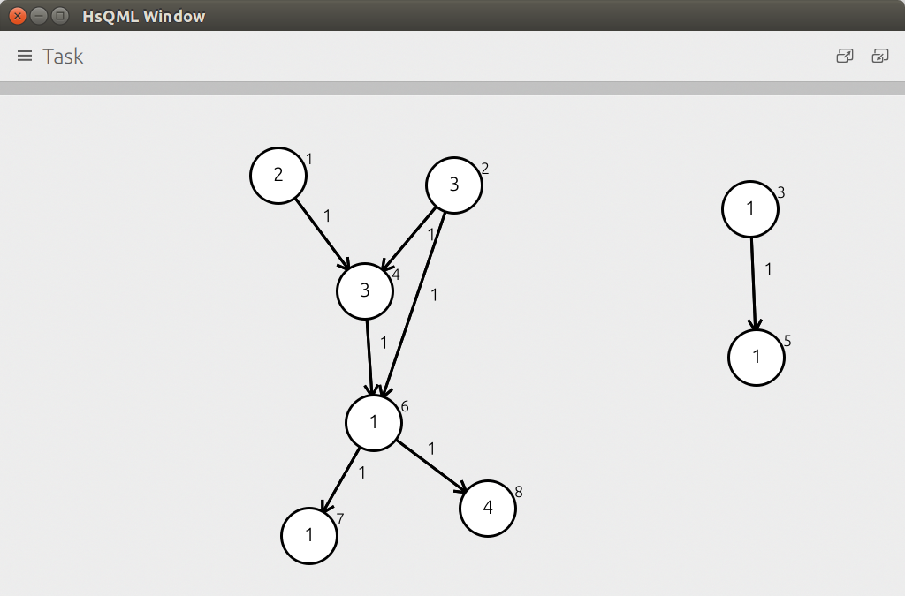
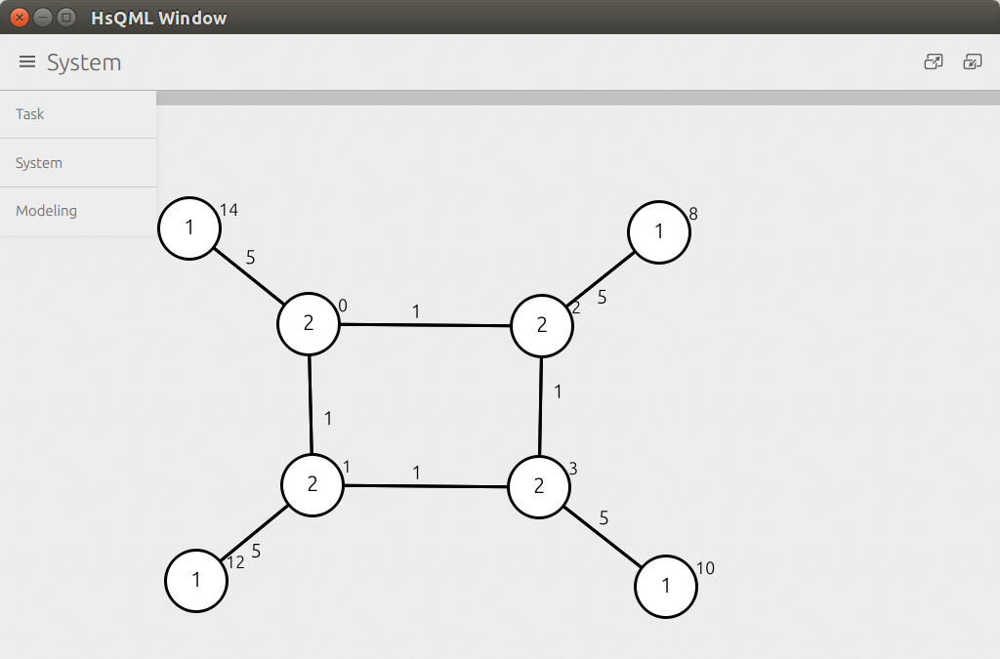
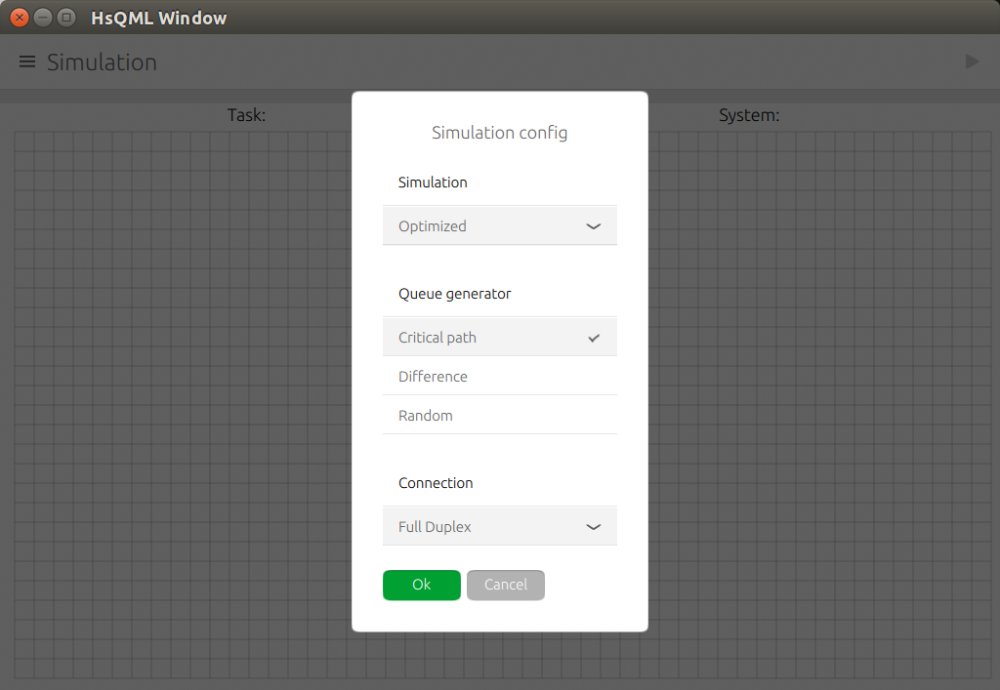
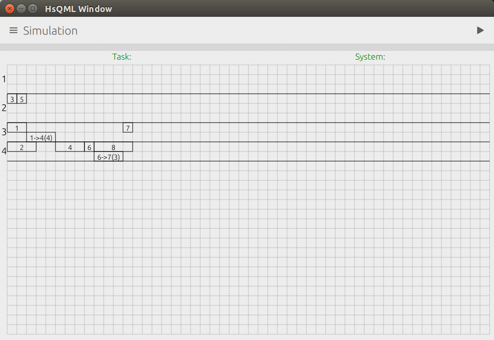

Static Sheluding Simulator
=========================

This application implements static sheduler with different sheduling algorithms.

This is university project written in Haskell and QML (`hsqml` package).

